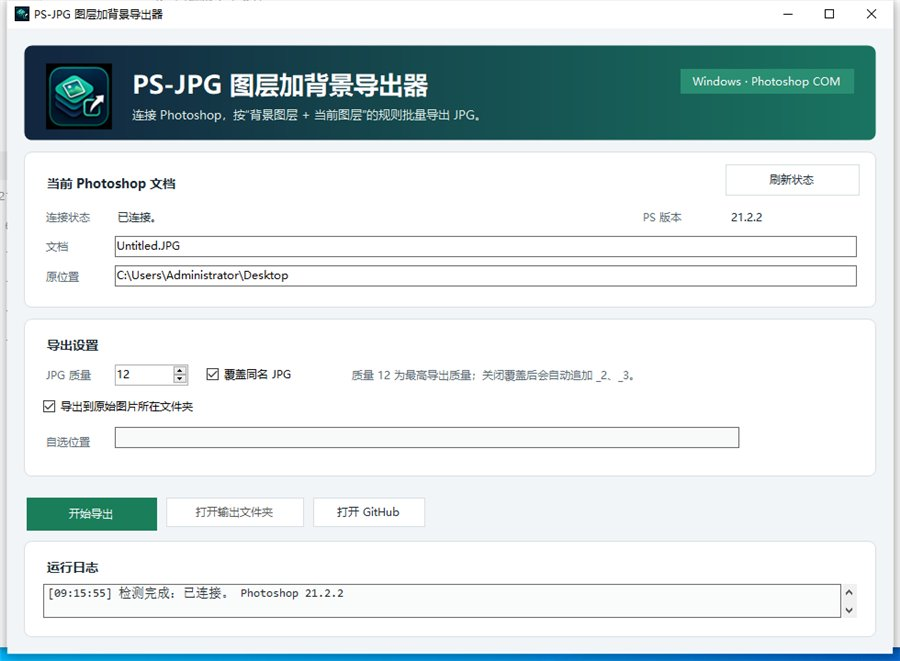

# PS-JPG 图层加背景导出器

这是一个用于 Adobe Photoshop 的图层批量导出工具：把当前文档中的每一个普通图层分别与背景图层合成，并导出为 JPG。

## 软件版下载

推荐使用软件版：

[下载 PS-JPG 软件版压缩包](dist/PS-JPG-software.zip)

解压后双击：

```text
PS-JPG图层加背景导出器.exe
```

软件版说明：

[查看软件版 README](software/README_software_zh.md)

## 软件版预览



## 主要功能

- 连接当前正在运行的 Photoshop。
- 自动识别当前 Photoshop 文档。
- 每张 JPG 都由“背景图层 + 当前普通图层”组成。
- 文件名使用 Photoshop 图层名称。
- 支持设置 JPG 质量。
- 支持覆盖同名 JPG 或自动追加序号。
- 支持导出到原始图片所在文件夹或自选文件夹。
- 成功/失败提示均为中文。
- 失败时会显示具体原因。
- 不保存、不修改当前 Photoshop 源文件。

## 背景图层判断规则

软件会按下面的优先级寻找背景：

1. Photoshop 标准 Background 图层。
2. 名称为 `Background`、`背景`、`背景图层` 的普通图层。
3. 如果都找不到，就使用最底部的普通图层作为背景。

## 仓库内容

```text
software/                         软件版文件、源码、Logo、截图
dist/PS-JPG-software.zip         软件版压缩包
ps_export_layers_with_background.jsx
run_export_layers_with_background.vbs
LICENSE
```

## 脚本版

如果只想使用脚本版，可以保留这两个文件在同一文件夹：

```text
run_export_layers_with_background.vbs
ps_export_layers_with_background.jsx
```

先打开 Photoshop 和要处理的文件，再双击 `.vbs` 文件即可运行。

## 开源协议

MIT License。
