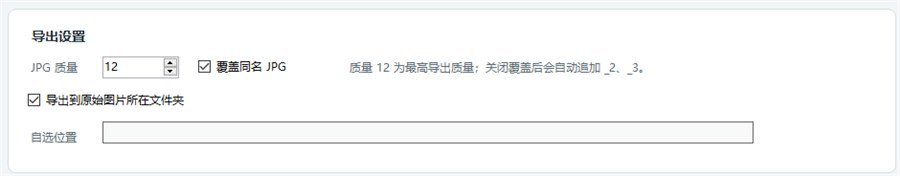
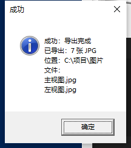
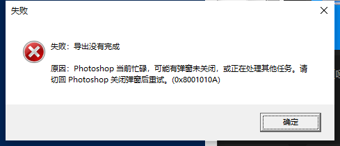

# PS-JPG 图层加背景导出器 - 软件版说明

这是“PS 图层加背景导出 JPG”脚本的软件版，适用于 Windows + Adobe Photoshop。

软件会连接当前正在运行的 Photoshop，把当前文档中的每一个普通图层分别和背景图层合成，然后批量导出为 JPG。

当前版本带有 Logo、程序图标、状态检测、Photoshop 版本显示、导出设置、运行日志、中文成功/失败提示，以及更稳定的布局。

Logo 使用生成图方案制作，并在本地压缩为小尺寸 PNG/ICO 后再嵌入软件，避免把大尺寸原图直接放进程序。

## 软件界面


界面分为四块：

1. 顶部 Logo 区：显示软件名称和用途。
2. 当前 Photoshop 文档：显示连接状态、Photoshop 版本、当前文档名和原始位置。
3. 导出设置：设置 JPG 质量、是否覆盖同名文件、导出位置。
4. 运行日志：显示检测、导出、错误提示等信息。

## 文件说明

主要文件：

```text
PS-JPG图层加背景导出器.exe
```

这是免安装程序，双击即可打开。软件本体已经带有专用图标。

配套资源：

```text
assets/logo-64.png
assets/logo-96.png
assets/logo-256.png
assets/app.ico
assets/screenshots/
source/Program.cs
```

`assets` 中是压缩后的 Logo、图标和说明截图。

`source/Program.cs` 是软件源码，方便以后继续升级或开源同步。

## 使用方法

### 第 1 步：打开 Photoshop

先打开 Adobe Photoshop。

软件会优先连接正在运行的 Photoshop，并自动扫描系统注册表中的 `Photoshop.Application.*` COM 版本号，因此比旧版更容易兼容不同 Photoshop 版本。

### 第 2 步：打开要处理的文件

在 Photoshop 中打开要处理的 PSD、PNG、JPG 或其他图片文件。

建议文件中至少包含：

```text
背景图层
主视图
左视图
右视图
俯视图
立体图
```

或类似的“背景 + 多个视图图层”结构。

注意：如果当前 Photoshop 文件是新建未保存的文档，软件无法判断“原始图片所在文件夹”。这种情况下请先保存文件，或打开一个已经存在于磁盘上的文件。

### 第 3 步：打开软件

双击：

```text
PS-JPG图层加背景导出器.exe
```

打开后会自动尝试检测 Photoshop 当前状态。

### 第 4 步：刷新状态

点击“刷新状态”。

确认界面中显示：

- 连接状态：已连接
- PS 版本：例如 `21.2.2`
- 文档：当前 Photoshop 文件名
- 原位置：当前文件所在文件夹

如果状态显示“无法连接 Photoshop”，请先确认 Photoshop 已经打开，并关闭 Photoshop 里的所有弹窗。

### 第 5 步：检查导出设置



可设置内容：

- `JPG 质量`：范围是 `1` 到 `12`，默认 `12`。`12` 是 Photoshop 脚本接口中的最高 JPG 质量。
- `覆盖同名 JPG`：默认开启。如果目标文件夹已有同名 JPG，会覆盖旧文件。
- `导出到原始图片所在文件夹`：默认开启。也就是 Photoshop 当前文档从哪里打开，JPG 就导出到哪里。
- `自选位置`：如果关闭“导出到原始图片所在文件夹”，会出现“浏览...”按钮，可以指定导出目录。

默认使用原始图片所在文件夹时，“浏览...”按钮会自动隐藏，避免误操作。

如果关闭“覆盖同名 JPG”，软件会自动追加序号，例如：

```text
主视图.jpg
主视图_2.jpg
主视图_3.jpg
```

### 第 6 步：开始导出

点击“开始导出”。

软件会按下面的逻辑批量处理：

1. 记录所有图层当前的显示状态。
2. 找到背景图层。
3. 隐藏所有图层。
4. 显示背景图层 + 当前要导出的普通图层。
5. 按当前图层名称导出 JPG。
6. 对下一个普通图层重复这个过程。
7. 全部导出后恢复原来的图层显示状态。

导出的 JPG 文件名来自 Photoshop 图层名。

例如图层名为：

```text
主视图
左视图
右视图
立体图
```

导出后会得到：

```text
主视图.jpg
左视图.jpg
右视图.jpg
立体图.jpg
```

### 第 7 步：查看导出结果

导出成功时，软件会弹出中文成功提示：



成功提示会显示：

- 成功：导出完成
- 已导出多少张 JPG
- 输出位置
- 导出的文件名

点击“打开输出文件夹”可以直接查看导出的 JPG。

导出失败时，软件会弹出中文失败提示：



失败提示会显示：

- 失败：导出没有完成
- 具体失败原因

例如 Photoshop 正在忙碌、有弹窗未关闭、没有打开文件、当前文档没有原始位置等。

## 背景图层判断规则

软件会按下面的优先级寻找背景：

1. Photoshop 标准 Background 图层。
2. 名称为 `Background`、`背景`、`背景图层` 的普通图层。
3. 如果都找不到，就使用最底部的普通图层作为背景。

如果导出的背景不对，请把背景层移动到最底部，或把它设成 Photoshop 标准 Background 图层。

## 是否会修改原文件

不会。

软件只会临时切换图层可见性，然后导出 JPG。导出结束后会恢复原来的图层显示状态。

软件不会保存当前 Photoshop 文档，也不会覆盖 PSD/PNG 源文件。

## 常见问题

### 软件提示无法连接 Photoshop

请确认：

- Photoshop 已经打开。
- Photoshop 没有被保存提示、警告提示等弹窗挡住。
- 电脑上安装的是支持 COM 自动化接口的 Photoshop。

### 软件提示当前文档没有原始位置

说明当前 Photoshop 文件可能是新建未保存的文档。

请先保存文件，或打开一个已经存在于磁盘上的文件。

如果文件来自磁盘但原位置仍不显示，请点击“刷新状态”。新版状态检测会通过 Photoshop 脚本读取 `activeDocument.path.fsName` 和 `activeDocument.fullName.fsName`，比旧版直接读取 COM 属性更稳定。

### 导出时提示 Photoshop 忙碌

通常是 Photoshop 里有弹窗挡住了脚本执行。

请切回 Photoshop，关闭保存提示、警告提示等弹窗，然后再运行导出。

### 导出的文件名乱码或奇怪

软件会直接使用 Photoshop 图层名作为 JPG 文件名。

如果图层名中有 Windows 文件名不允许的字符，例如：

```text
\ / : * ? " < > |
```

软件会自动替换成 `_`。

## 开源地址

GitHub：

https://github.com/pzk1221/PS-JPG
